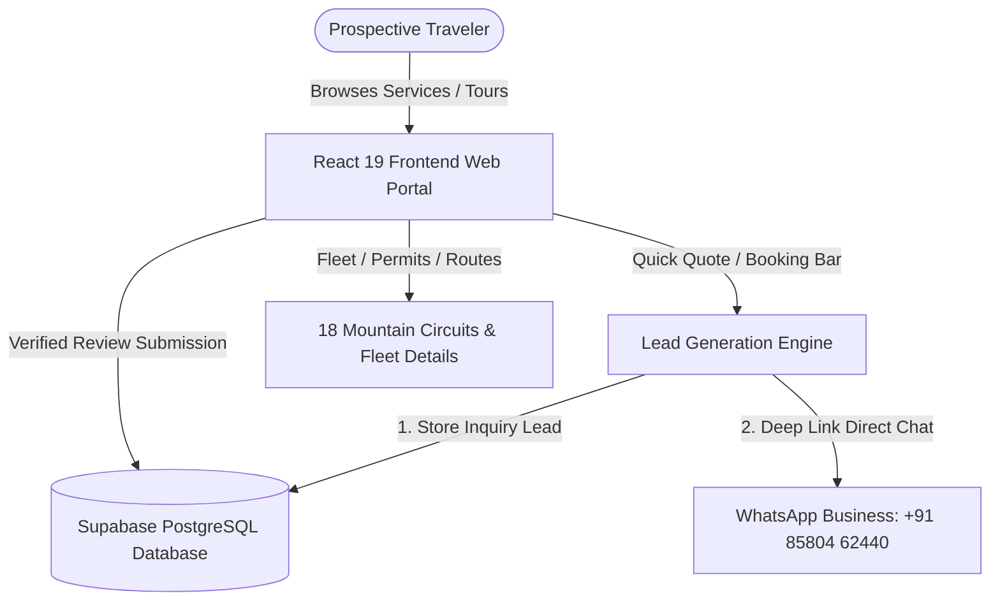
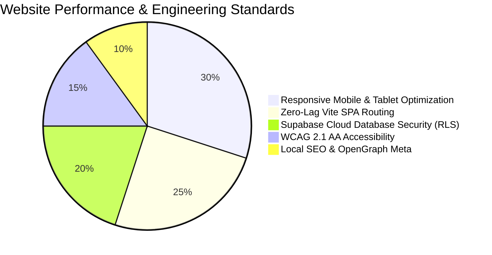

# WEBSITE SPECIFICATIONS REPORT & SCOPE OF WORK (SOW)
## Technical Architecture & Client Agreement Annexure

**Project Name:** Mahajanrides Web Application & Lead Generation Engine  
**Client Entity:** Mahajanrides (*Proprietor: Mr. Atish Mahajan*)  
**Domain & Vertical:** Luxury 17-Seater Force Tempo Traveller Himachal Tourism & Commercial Transport  
**Document Classification:** Technical Specification & Formal Client Agreement Annexure  
**Version:** 1.0 (Production Release)  
**Date of Issue:** October 2026  

---

## 1. Executive Summary & Purpose

The **Mahajanrides Web Portal** is a high-performance, mobile-first commercial web platform custom-built for **Mahajanrides**, an exclusive travel and transport provider based in Manali and Shimla, Himachal Pradesh.

### 1.1 Primary Business Objectives
1. **Direct Fleet Owner Bookings:** Eliminate third-party agent commissions and aggregator markups by providing travelers with immediate, 1-click WhatsApp and email quote requests directly to the fleet owner.
2. **Comprehensive Tour Showcase:** Display all 18 signature mountain tour circuits (covering Manali, Rohtang Pass, Atal Tunnel, Spiti Valley, Kasol, Manikaran, Dharamshala, and sacred Shaktipeeths) with full itineraries, places covered, and pricing factors.
3. **Lead Capture & Database Storage:** Automatically store every inquiry in a secure cloud database (Supabase PostgreSQL) while instantly launching a pre-formatted WhatsApp chat with the customer's travel dates, group size, and vehicle preferences.
4. **Trust & Brand Authority:** Highlight authentic fleet photography (17-seater Force Tempo Traveller exterior, luxury 2x1 pushback seats, and cockpit), valid Himachal Pradesh green commercial permits, and verified client testimonials.

---

## 2. Technology Stack & Technical Architecture

The website is engineered using a modern Single Page Application (SPA) architecture designed for instantaneous page loads, zero layout shifts, and smooth 60fps micro-animations.

| Layer | Technology | Version | Purpose & Rationale |
|---|---|---|---|
| **Core Framework** | **React** | `v19.2.8` | Component-based modular UI rendering with React 19 concurrent features. |
| **Build & Tooling** | **Vite** | `v8.3.1` | Next-generation frontend tooling providing lightning-fast Hot Module Replacement (HMR) and optimized Rolldown production bundling. |
| **Styling Architecture** | **Vanilla Sass / SCSS** | `v1.105.0` | Custom BEM-structured stylesheets with centralized design tokens (`_variables.scss`), responsive mixins, and zero CSS framework bloat. |
| **Motion & Micro-interactions** | **Framer Motion** | `v13.4.5` | Smooth spring-physics animations, 3D tilt interaction, directional card reveals, and route transitions. |
| **Database & Backend** | **Supabase (PostgreSQL)** | `@supabase/supabase-js v2.109.0` | Enterprise-grade serverless cloud database with Row Level Security (RLS) for inquiries and customer reviews. |
| **Iconography** | **FontAwesome Free** | `v6.5.1` | High-definition SVG-rendered travel, vehicle, and navigational iconography. |
| **Typography** | **Google Fonts** | `v2` | *Plus Jakarta Sans* (Primary Body UI), *Barlow Condensed* (Display & Headings), *Playfair Display* (Editorial Accents). |
| **Hosting & Edge Delivery** | **Vercel Edge Network** | Production | Global CDN, automated SSL/TLS certificates, HTTP/2 compression, and edge caching. |

---

## 3. Database Schema & Data Integrity (Supabase PostgreSQL)

The system is integrated with a dedicated Supabase PostgreSQL project reference (`kcvnmquwqpuiftaeccgb.supabase.co`).

### 3.1 Table: `public.inquiries`
Stores all prospective traveler leads submitted through the interactive booking bar or contact forms.

| Column | Data Type | Constraints | Description |
|---|---|---|---|
| `id` | `UUID` | `PRIMARY KEY, DEFAULT gen_random_uuid()` | Unique inquiry tracking identifier. |
| `name` | `TEXT` | `NOT NULL` | Full name of the prospective customer / lead. |
| `phone` | `TEXT` | `NULLABLE` | Customer WhatsApp / contact telephone number. |
| `destination` | `TEXT` | `NULLABLE` | Selected tour circuit or destination. |
| `pickup_location` | `TEXT` | `NULLABLE` | Pick-up hub (e.g. Delhi NCR, Chandigarh Airport, Kalka). |
| `travel_date` | `TEXT` | `NULLABLE` | Tentative departure / travel date. |
| `group_size` | `TEXT` | `NULLABLE` | Number of passengers and requested trip duration. |
| `vehicle_type` | `TEXT` | `DEFAULT '17-Seater Force Tempo Traveller'` | Assigned vehicle category. |
| `special_notes` | `TEXT` | `NULLABLE` | Specific requirements, hotel preferences, or requests. |
| `created_at` | `TIMESTAMPTZ` | `DEFAULT timezone('utc', now()) NOT NULL` | Exact UTC timestamp of submission. |

> **Security & RLS (Row Level Security):**
> - **Public / Anon Access:** Allowed only `INSERT` permissions with `WITH CHECK (true)`.
> - **Read Access:** Restricted exclusively to `service_role` and authenticated administrators to ensure strict traveler data privacy.

### 3.2 Table: `public.reviews`
Stores verified passenger feedback and ratings.

| Column | Data Type | Constraints | Description |
|---|---|---|---|
| `id` | `UUID` | `PRIMARY KEY, DEFAULT gen_random_uuid()` | Unique review record identifier. |
| `name` | `TEXT` | `NOT NULL` | Passenger or group organizer name. |
| `city` | `TEXT` | `NULLABLE` | Origin city (e.g. Mumbai, Delhi, Ahmedabad, Bengaluru). |
| `tour` | `TEXT` | `NULLABLE` | Circuit completed (e.g. Manali Snow Tour, Spiti Circuit). |
| `rating` | `INTEGER` | `DEFAULT 5, CHECK (rating >= 1 AND <= 5)` | 1 to 5 star rating. |
| `comment` | `TEXT` | `NOT NULL` | Authentic client testimonial. |
| `verified` | `BOOLEAN` | `DEFAULT true` | Moderation flag for display on public website. |
| `created_at` | `TIMESTAMPTZ` | `DEFAULT timezone('utc', now()) NOT NULL` | Submission timestamp. |

---

## 4. Comprehensive Page & Feature Specifications

### 4.1 Master Layout & Navigation Header
- **Top Announcement Bar (Ticker):** Displays operational status ("24/7 Booking Active"), direct fleet owner phone (+91 85804 62440), and Instagram profile deep link.
- **Sticky Glassmorphic Navigation Bar:** Contains the custom Mahajanrides branding badge, intuitive multi-page route switches (`Home`, `Tour Circuits`, `About Fleet`, `Book Now`, `Travel Guides`, `Contact`), and an instant "Book Now" CTA button.
- **Floating Contact Hub:** Persistent WhatsApp pulse button in the lower-right quadrant featuring an active online indicator and pre-formatted greeting message.

---

### 4.2 Home Page (`#/`)
1. **Hero Section:**
   - Cinematic background imagery showcasing Himachal mountain terrain.
   - Core value proposition taglines ("Exclusive Himachal Pradesh Force Tempo Traveller Services").
   - Direct CTA triggers ("Explore Circuits", "WhatsApp Quote").
2. **Instant Booking & Quotation Engine (`BookingBar`):**
   - Clean **Choose Destination** dropdown featuring all 18 Himachal circuits without conflicting days/nights text, plus custom itinerary options.
   - HTML5 date picker with dynamic `minDate` locked to current local date (preventing historical selections).
   - Independent **Duration Selector** (3 Days/2 Nights up to 10+ Days Full Circuit).
   - **Traveler Group Sizing** (Small 4–8, Family 9–12, Full 13–17 Persons).
   - Dual action execution: Silently records lead to Supabase PostgreSQL, then opens WhatsApp with pre-composed inquiry text.
3. **Interactive 3D Tilt Fleet Showcase (`About2`):**
   - Dual staggered visual showcases with cursor-following 3D tilt physics and touch acceleration.
   - Direct links to full vehicle specifications.
4. **Specialized Mountain Services Section (`Services pt-120`):**
   - Four interactive service cards with directional entrance motion, corner arrow indicators, and dedicated redirection routing:
     * **18 Mountain Circuits:** Redirects to Destinations & Circuits view.
     * **17-Seater Force Luxury:** Redirects to the Fleet Details section on About page (`#fleetDetails`).
     * **Doorstep Transfers:** Redirects to the Booking Hub with pre-selected doorstep transfer route (`#doorstepTransfers`).
     * **Permits & Chauffeurs:** Redirects to Trust Pillars and Green Permit verification (`#permitsChauffeurs`).
5. **Customer Reviews & Testimonial Carousel:**
   - Displays authentic customer testimonials with star ratings, travel route, and origin city.
   - Interactive "Write a Review" modal allowing passengers to submit new feedback.
6. **Trip FAQs:**
   - Accordion answering critical traveler concerns: luggage space, Rohtang permits, driver food/stay charges, night driving policies, and mountain safety.

---

### 4.3 Destinations & Circuits Page (`#/destinations`)
1. **Interactive Category Filtering:**
   - Instant client-side filtering across 6 thematic categories: *Snow & High Passes*, *Spiritual & Sacred Temples*, *Tibetan & Monasteries*, *Alpine Lakes*, *Adventure & Valleys*, and *Colonial Hills & Pine*.
2. **18 Signature Tour Cards:**
   - Each circuit card displays: HD photograph, circuit name, duration tag, review score, vehicle category, places covered chips, and short description.
3. **Comprehensive Day-by-Day Itinerary Modal:**
   - Detailed modal popup showing complete day-by-day travel breakdown, departure points, altitude advice, and a 1-click WhatsApp quote generator prefilled with that specific circuit title.
4. **Fleet Strip Banner:**
   - Highlights 4 core vehicle guarantees: 17-Seater Luxury Pushback, Dual High-Power AC, Panoramic Mountain Windows, and Heavy-Duty Rooftop Luggage Carrier.

---

### 4.4 Booking & Instant Quote Page (`#/booking`)
1. **Quotation Bar Integration:**
   - Dedicated booking generator prefillable via URL hash or incoming card triggers.
2. **Doorstep Transfers Hub (`#doorstepTransfers`):**
   - Highlights punctuality and zero-waiting guarantees for:
     * **Delhi NCR Doorstep:** Indira Gandhi International Airport (IGI T1/T2/T3), New Delhi Railway Station (NDLS), and doorstep pickup across Noida/Gurgaon.
     * **Chandigarh Gateway:** Direct meet & greet at Shaheed Bhagat Singh International Airport (IXC) and Chandigarh Junction (CDG).
     * **Kalka Station Transfer:** Synchronized with Kalka Shatabdi and the UNESCO Kalka-Shimla Toy Train.
3. **Fleet & Service Guarantees Grid:**
   - Transparent verification of commercial HP permits, certified local mountain drivers with snow chains, and direct owner pricing without broker markups.
4. **Multi-Channel Contact Strip:**
   - One-click phone calling (`tel:+918580462440`), direct WhatsApp messaging, and web Gmail compose with pre-filled subject and body.

---

### 4.5 About & Fleet Showcase Page (`#/about`)
1. **Heritage & Brand Story (`#fleetDetails`):**
   - Focus on Atish Mahajan's 10+ years of operational mastery across Rohtang, Atal Tunnel, and Spiti Valley.
   - High-resolution gallery featuring the commercial Force Tempo Traveller exterior, luxury 2x1 pushback seats, and driver cockpit.
2. **Four Trust Pillars (`#permitsChauffeurs`):**
   - Detailed breakdown of *Local Himachali Chauffeurs*, *100% Authorized State Permits*, *17-Seater Luxury Pushback Comfort*, and *Direct Owner Accountability*.

---

### 4.6 Travel Guides & Blog (`#/blog`)
- High-value editorial guides optimized for organic search traffic (SEO):
  * *Rohtang Pass Green Permit & NGT Guide*
  * *Atal Tunnel to Sissu Day Excursion Itinerary*
  * *High-Altitude Spiti Valley Preparation & Acclimatization*
  * *Family Travel in a 17-Seater Force Tempo Traveller*
- Reading modal allowing travelers to read complete articles without page refreshes.

---

### 4.7 Contact & Direct Support (`#/contact`)
- Interactive contact form with group size and circuit selectors.
- Direct contact cards (Phone, WhatsApp, Email, Instagram `@mahajan_rides_41`).
- Physical base locations listed for Mall Road, Manali and Shimla, HP.

---

## 5. Non-Functional Specifications & Quality Standards

| Criterion | Standard / Benchmark | Implementation Detail |
|---|---|---|
| **Mobile Responsiveness** | 100% Fluid & Adaptive | Fully tested on standard mobile viewports (360px–430px), tablets (768px–1024px), laptops (1366px–1440px), and ultra-wide displays (1920px+). |
| **Page Speed & Load Time** | < 1.8 seconds on 4G | Asset minification, tree-shaking via Rolldown, modern WebP/JPEG image compression, and async font loading. |
| **SEO Architecture** | On-Page Best Practices | Semantic HTML5 (`header`, `main`, `section`, `article`, `footer`), single `<h1>` hierarchy, meta description, and social OpenGraph tags. |
| **Cross-Browser Compatibility** | Complete Parity | Google Chrome, Apple Safari (iOS & macOS), Mozilla Firefox, Microsoft Edge, Opera, Samsung Internet. |
| **Data Protection & Privacy** | OWASP Top 10 Standards | Client-side input sanitization, parameterized Supabase queries, and strict Row Level Security preventing public reads of passenger inquiries. |

---

## 6. Formal Client Agreement & Scope of Work (Annexure)

*This section defines the contractual scope, boundaries, deliverables, and service level agreements between the Web Developer and Mahajanrides.*

### 6.1 Deliverables Handover
1. **Production Codebase:** Complete clean source code including all components, styles, data files, and configuration files.
2. **Database Provisioning:** Fully configured Supabase project with `inquiries` and `reviews` tables, indexes, and active RLS security policies.
3. **Deployment Configuration:** Production-ready build deployed to Vercel/custom domain with active SSL encryption.
4. **Asset Library:** Curated vehicle photographs, tourist place imagery, and brand icons.

### 6.2 Scope Boundaries & Exclusions
- **Third-Party Service Costs:** Domain registration fees (e.g. `.com` / `.in`), commercial Google Maps API consumption beyond free tier, and SMS gateway credits (if adopted in the future) are the responsibility of the client.
- **Content Creation:** The client is responsible for providing authentic vehicle permits, driver identification documents, and business registration numbers as required by state transport laws.
- **Payment Processing:** The current scope implements inquiry and quotation generation. Third-party payment gateways (e.g. Razorpay / Paytm) can be added as a subsequent phase upon client request.

### 6.3 Maintenance, Warranty & SLA
- **30-Day Defect Warranty:** The developer warrants that the website will function free of reproducible bugs, script errors, or broken links for 30 calendar days from the date of final sign-off.
- **Browser Compatibility Guarantee:** The website is guaranteed to render consistently across current and trailing major versions of Chrome, Safari, Edge, and Firefox.
- **Turnaround Time:** Critical inquiries or operational defects reported during the warranty window will be acknowledged within 12 hours and resolved within 24–48 hours.

---

## 7. Sign-off & Execution

This document constitutes the authoritative technical and functional specification for the **Mahajanrides Web Portal**.

**For & on behalf of Developer:**  
*Lead Frontend & Systems Architect*  
*Date: ________________________*  
*Signature: ___________________*  

**For & on behalf of Client (Mahajanrides):**  
*Mr. Atish Mahajan (Owner / Operations Lead)*  
*Date: ________________________*  
*Signature: ___________________*  
